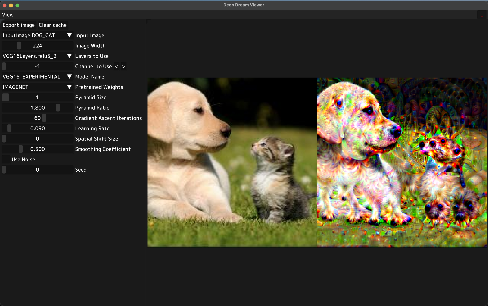

#  Interpretability Building Blocks

This repository contains implementations of building blocks of interpretability. (inspired by https://distill.pub/2018/building-blocks/)

Current supporting DeepDream only (part of Feature Visualization), but will be extended to more building blocks in the future.

To create the environment, run `conda env create -f environment.yml`. To update the environment, run `conda env update -f environment.yml`.

You can easily play around with the code by running the following command:

```bash
python deepdream_view.py
```




```bibtex
@article{olah2017feature,
  author = {Olah, Chris and Mordvintsev, Alexander and Schubert, Ludwig},
  title = {Feature Visualization},
  journal = {Distill},
  year = {2017},
  note = {https://distill.pub/2017/feature-visualization},
  doi = {10.23915/distill.00007}
}
```

